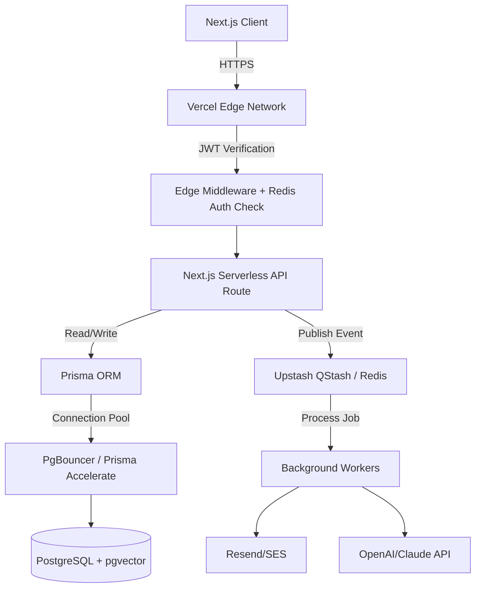

# Final Production Architecture Review & Improvements

> **Type:** Architectural Audit & Refactor Proposal
> **Scope:** Multi-Tenant CRM SaaS

Following a comprehensive review of the Phase 1 and 2 architecture blueprints, several critical areas requiring fortification for true enterprise-grade production readiness were identified.

---

## 1. Identified Risks & Vulnerabilities

### A. Architectural Flaws & Tenancy Risks
- **Flaw:** The previous architecture mapped `User` directly to `Company` via a `companyId` foreign key.
- **Risk:** In B2B SaaS, a user (e.g., an external consultant or investor) often belongs to multiple workspaces. Binding an email address rigidly to a single workspace prevents users from being invited to other workspaces.
- **Risk:** Manual injection of `companyId` into repository `where` clauses is highly prone to human error, risking catastrophic cross-tenant data leaks.

### B. Scalability Bottlenecks
- **Flaw:** Next.js Serverless Functions directly interacting with PostgreSQL.
- **Risk:** Rapid connection exhaustion (TCP overhead) during high traffic spikes.
- **Flaw:** Real-time dashboard updates rely on client-side polling.
- **Risk:** Polling continuously hits the DB, causing extreme load on the database.

### C. Missing Database Indexes
- **Flaw:** Lack of compound indexes on frequently queried combinations.
- **Risk:** Queries for "My Leads" (`assignedBdeId` + `status`) or "Dashboard Overviews" will result in sequential table scans, degrading performance exponentially as data grows.

### D. Security Vulnerabilities
- **Flaw:** JWT sessions are valid until expiration without real-time revocation capabilities in a pure edge middleware setup.
- **Risk:** If a BDE is fired, they retain access until the JWT expires unless a DB lookup occurs on every request (which kills edge performance).

### E. RBAC & Business Logic Gaps
- **Flaw:** "Hard deletes" (using Prisma `delete`) destroy historical data.
- **Risk:** Deleting a user or lead orphans audit logs and destroys historical analytics.
- **Flaw:** No approval flow state model for "Request Reassignment".

### F. Future AI Integration Limitations
- **Flaw:** The database does not natively support embeddings.
- **Risk:** RAG (Retrieval-Augmented Generation) for "AI Proposal Generators" will require inefficient external synchronization.

---

## 2. Implemented Refactoring & Architecture Upgrades

To resolve these issues, the architecture has been refactored. The `prisma/schema.prisma` file has already been updated to reflect these changes.

### 2.1 Multi-Workspace Model (Intersection Table)
We removed `companyId` from the `User` model and introduced a `Membership` table.
```prisma
model Membership {
  userId      String
  companyId   String
  role        UserRole
  @@unique([userId, companyId])
}
```
*Benefit:* Users can now exist in multiple tenants. The Super Admin logic is decoupled to an `isSuperAdmin` boolean on the User record.

### 2.2 Soft Deletes & Audit Integrity
We implemented `deletedAt DateTime?` on `Company`, `User`, and `Lead`.
*Benefit:* Records are logically deleted but retained in the DB, preserving historical reports and preventing orphaned foreign keys.

### 2.3 Compound Indexing
Added critical compound indexes for the most heavily trafficked dashboard queries:
```prisma
@@index([companyId, status])
@@index([companyId, assignedBdeId])
```

### 2.4 Token & Session Security Upgrade
- **Implementation Strategy:** Switch to a dual-token system. Short-lived Access Tokens (15 min) + HttpOnly Refresh Tokens (7 days). 
- **Revocation:** Store a mapping of revoked tokens in a fast Redis cache (Upstash). Middleware checks Redis (which runs on the Edge) instead of PostgreSQL, achieving 10ms latency revocation without DB hits.

### 2.5 Real-Time Infrastructure (SSE / WebSocket)
- **Implementation Strategy:** Implement Server-Sent Events (SSE) via Next.js App Router for the Notification bell and Dashboard widgets. Alternatively, utilize Supabase Realtime / Pusher for WebSocket connections.

### 2.6 Background Job Queues
- **Implementation Strategy:** Utilize Upstash QStash or a lightweight Redis BullMQ for deferred processing. When a Lead is assigned, an event is published to the queue. The queue worker handles sending the Email and logging the Audit event, returning a `200 OK` to the user instantly.

### 2.7 AI-Ready Vector Database Preparation
- **Implementation Strategy:** Enable the `pgvector` PostgreSQL extension. Add a `DocumentEmbedding` model in the future with a `vector` data type to store high-dimensional embeddings of all Proposals and Meeting notes natively alongside relational data.

---

## 3. Final Production Blueprint Architecture



### Next Steps for Implementation (Phase 4.2)
With the foundation secured against architectural flaws, the Leads and Pipeline modules can now be built safely on top of the robust `Membership` and `Soft Delete` patterns.
